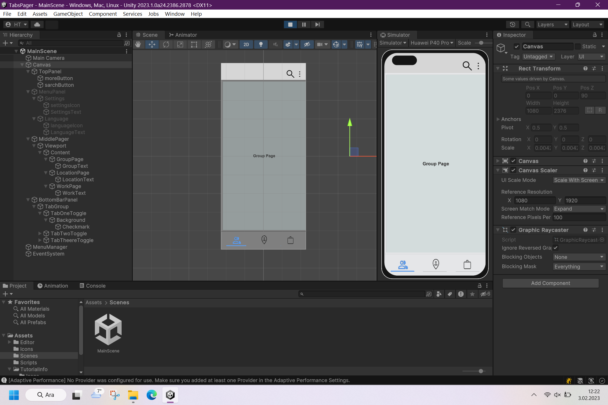
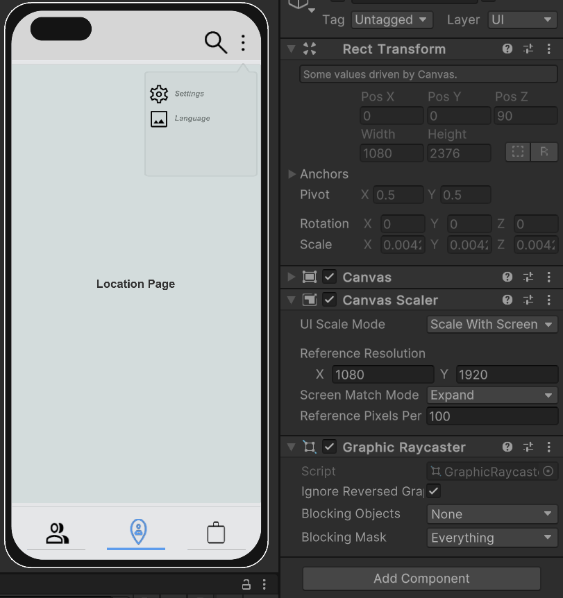

# Screenshot
 
 

# Unity-2D-Tab-System
 Unity 2D Simple Tab System

# How to Install
 **TabPagerScene** package import your Unity 2D project. Or download my starter project [Unity-2D-1080x1920-Only-Horizontal-Best-Optimized-Free-Scene](https://github.com/saglik216/Unity-2D-1080x1920-Only-Horizontal-Best-Optimized-Free-Scene "Unity-2D-1080x1920-Only-Horizontal-Best-Optimized-Free-Scene"), after import this
